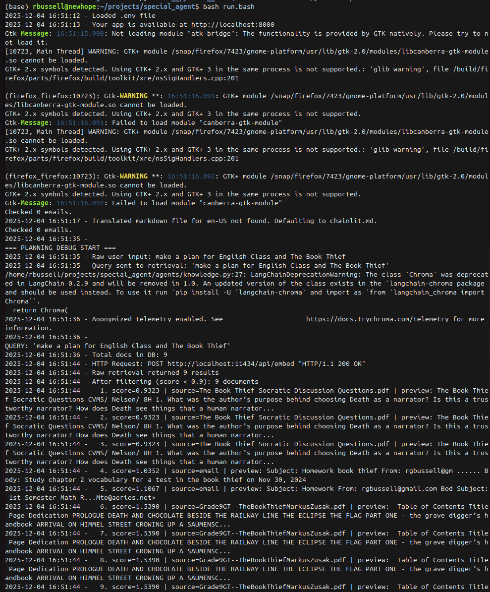
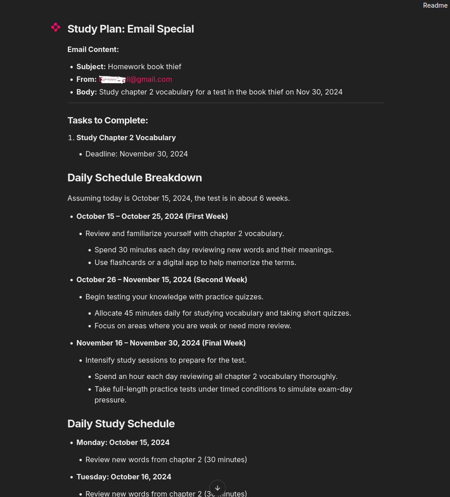

## special_agent
Experiments in connecting agents, memory management, communication, team work and love

## homework scheduler, awareness, organizer and tutor
* Provide a data secure way to automate the process of keeping track
of homework assignments for the family while sharing the information
to crate tutors based on the homework

## set up your gmail app password
For gmail the app password is available as a 16-character string.<br>
Place it in .env so the app can ingest updated information from email.

## installation
### run the installer to setup ollama, pull the models and setup venv
### with python dependencies
### after install, verify the models are setup by running test_models.bash
```
bash setup/install.bash
./special_agent/tests/test_models.bash
```
## successful model loads should produce this output (or something like that)
```
Testing models in Ollama...
Testing model: qwen2.5:14b-instruct-q6_K
Hello! It's nice to meet you. How can I assist you today?

Testing model: llama3.2:3b
Hello! It's nice to meet you. Is there something I can help you with or would you like to chat?

Model testing complete.
```

## running the code
### 1. Start Ollama (leave this terminal open)
```
ollama serve
```

### 2. In another terminal
```
cd "${HOME}/projects/special_agent/"
source venv/bin/activate
chainlit run ui/app.py -w
```

## Ensuring that crewai does not use openai
There are some bugs in crewai it seems that cause it to still try to 
use the openai api. You need to set the openai api key env var to
get crewai to work even if it doesn't contact open ai.

Use tcpdump to check if the open ai calls are still being made. I found
that even when ChatOllama was being used for chat that the open ai calls
were in fact still being made. I had OPENAI_API_KEY set to a fake value
so the calls were not successful which was a good save.

## removing the crewai dependency
To eliminate the calls to openai I am rearchitecting the approach around
using LangChain which does not have the openai connection through crewai.
Tagging the branch prior to this change as 0.0.1

## Driving focus on the materials supplied
The LLM has an assignment pdf but does not seem to be using it to 
drive its responses. What I am trying to improve the focus on the
relevant materials:
* Improve the prompt to direct it towards the materials
* Increase the retrieval count
* Use similarity search with score
* Inject the full text, not just summaries
* Add a force-read prep step 

## Success for Phase 1
We can respond to queries -- read local files into the vector database,
query it and return relevant responses. Below are some screenshots
showing the response a query about The Book Thief. Here we see the pdf
file of the book was added to the vector database, the database query
returns relevant reponses related to the book.




## Success: Emails can be read into vector database
Assignments can be read from email!
Here the UI integration is also shown.

